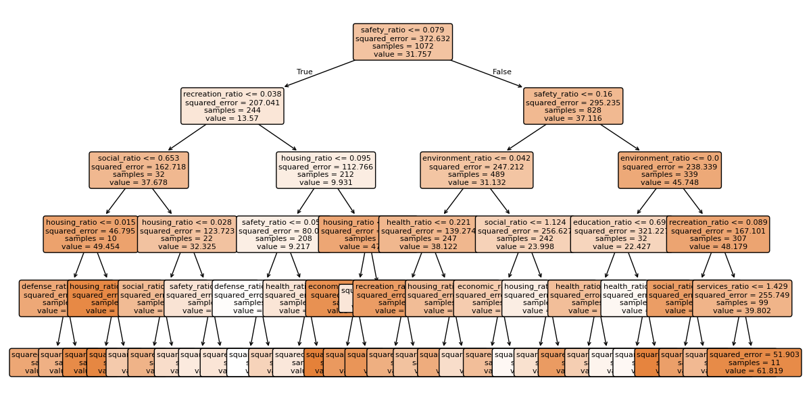
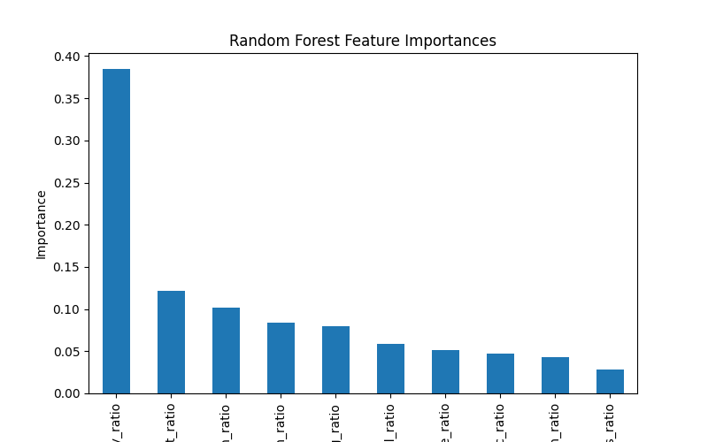
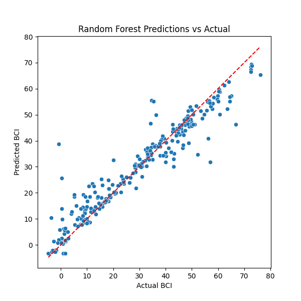

# Natural Resource Exports & HDI Analysis

A forked project from [ML Resource Analysis](https://github.com/zwk010/ML-Analysis-of-Resource-Exports-and-HDI-Trends) focusing more directly on corruption.

Decision Tree:  
  

Random Forest:  
  
  

Data Sources:
[QOG Dataset](https://www.gu.se/en/quality-government/qog-data)
[Specific Subset of Data](https://datafinder.qog.gu.se/downloads?download=gfs_def,gfs_ecaf,gfs_educ,gfs_envr,gfs_gps,gfs_hca,gfs_heal,gfs_pos,gfs_rcr,gfs_sp,ictd_revinsc,bci_bci)
