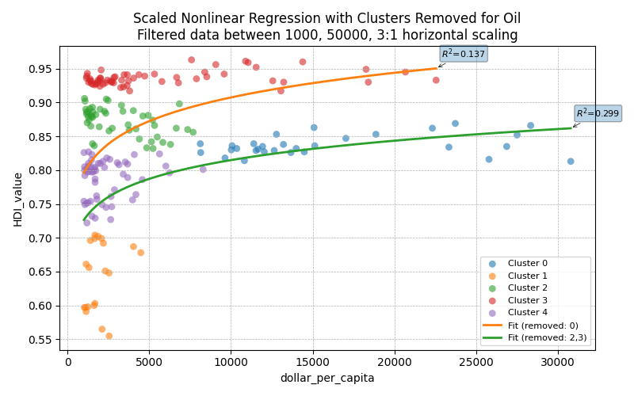
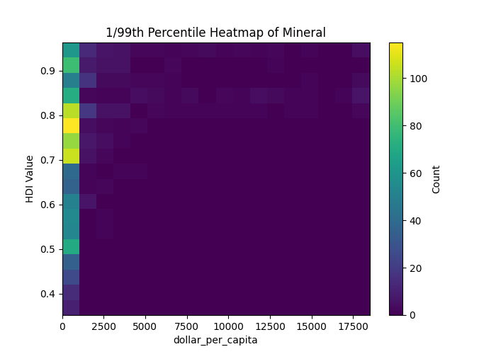
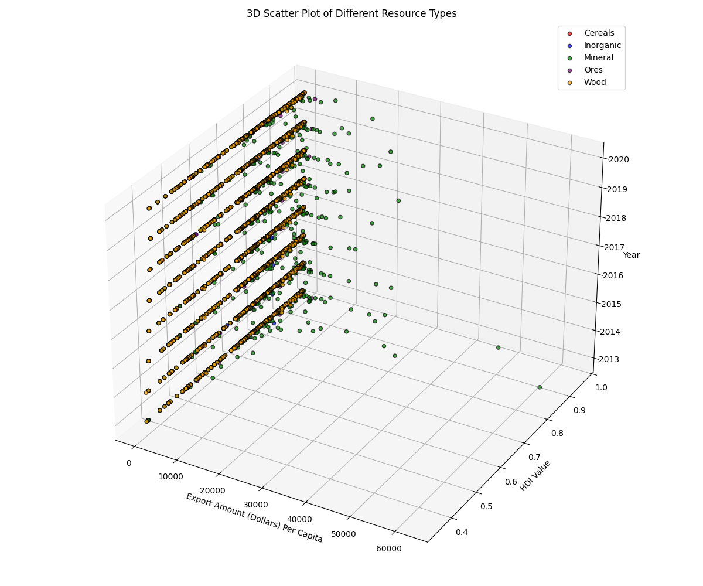
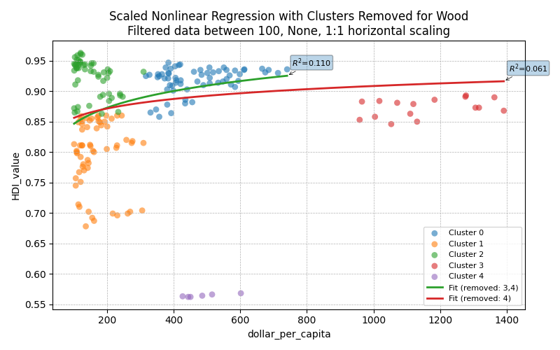
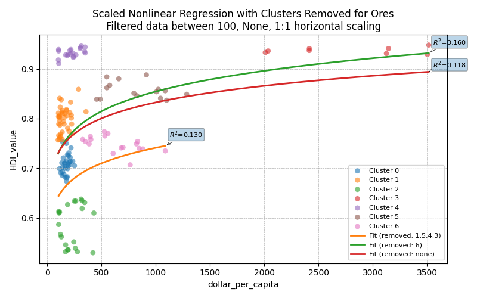
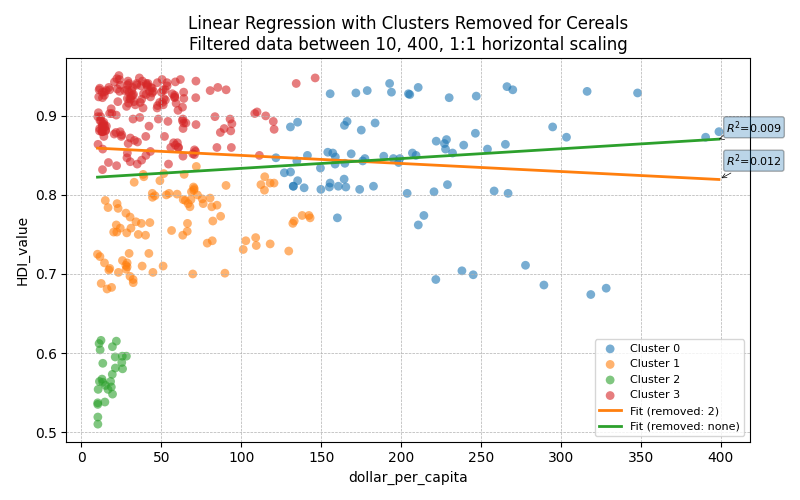
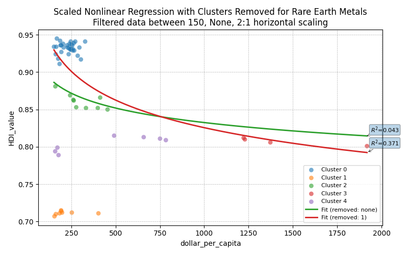

# Natural Resource Exports & HDI Analysis

## Project Overview
<table>
  <tr>
    <td></td>
    <td></td>
  </tr>
</table>
This project investigates the complex relationship between natural resource exports and a country's Human Development Index (HDI). The impact of such exports has long been debated, with some theories suggesting accelerated development through capital inflow, while others point to negative effects like the "resource curse" and "Dutch disease," fostering corruption and complacency. Our goal is to analyze these competing hypotheses by examining the net effect of natural resource exports on the HDI, providing a unified perspective on their true impact.

We specifically focus on the export of cereal, oil, lumber, rare earth metals, and ores from countries worldwide during the period 2010-2020. The Human Development Index (HDI) serves as our primary metric, a composite index encompassing life expectancy, education, and standard of living.



# Short Report
We find that low HDI < 0.75 and high mineral (oil) resource exports > 1000 to exemplify the "resource curse" phenomenon.
Despit such high exports in excess of 1000 dollars per capita, many of these countries seem to lack improvements in HDI and have high levels of curruption or inequity.
HDI-to-export ratio in the HDI filtering function of metrics.py was not found to be useful.


[Cluster 1 Resource Curse States](data/clustering_results/mineral_group_1.csv)

Angola (2013, 2014, 2015, 2017, 2018, 2019)  
Congo (2013, 2018)  
Gabon (2013, 2014, 2015, 2016, 2017, 2018, 2019, 2020)  
Iraq (2013, 2014, 2015, 2016)  

[Cluster 4 Rentier States](data/clustering_results/mineral_group_4.csv) 

Algeria (2013, 2014)  
Azerbaijan (2013, 2014, 2015, 2016, 2017, 2018, 2019, 2020)
Belarus (2013, 2014)  
Guyana (2020)  
Kazakhstan (2013, 2014, 2015, 2016, 2017, 2018, 2019, 2020)  
Libya (2016, 2017, 2018, 2019)  
Malaysia (2013, 2014, 2015, 2017, 2018, 2019)  
Mongolia (2018, 2019)  
Oman (2015, 2020)  
Russian Federation (2013, 2014, 2015, 2016, 2017)  
Seychelles (2013, 2014, 2015, 2016, 2017, 2018, 2019)  
Trinidad and Tobago (2013, 2014, 2015, 2016, 2017, 2018, 2019, 2020)  
Venezuela (2013)

[Cluster 0 Gulf States](data/clustering_results/mineral_group_0.csv)

Bahrain (2013, 2014)  
Brunei Darussalam (2013, 2014, 2015, 2016, 2017, 2018, 2019, 2020)  
Kuwait (2013, 2014, 2015, 2016, 2017, 2018, 2019, 2020  
Oman (2013, 2014)  
Qatar (2015, 2016, 2017, 2018, 2019, 2020)  
Saudi Arabia (2013, 2014)  
United Arab Emirates (2013, 2014)   

Rare earth metals were the exception to any trend, with a resounding *negative* correlation between HDI and export levels, suggesting that exporting rare earth metals was something more developed countries quickly abandoned (enviromental damage, for example), or something forced upon lesser developed countries by necessity (pollution haven hypothesis (PHH)).
Cereals, wood, and ores had normal trends where wealth and HDI were heavily correlated and abnormalities limited.

<table>
  <tr>
    <td></td>
    <td></td>
  </tr>
  <tr>
    <td></td>
    <td></td>
  </tr>
</table>

## Key Features

* **Comprehensive Data Analysis:** Utilizes data from UN Comtrade and UNDP's HDI database for a robust analysis.
* **Multi-Methodological Approach:** Employs a combination of linear regression, K-means clustering, and nonlinear regression to uncover various aspects of the relationship.
* **Statistical Validation:** R-squared measures are used to assess the accuracy of our regression models.
* **Visualizations:** Preliminary plots and scatterplots help in understanding global HDI trends and the relationship between specific resources and HDI.
* **Clustering for Insights:** K-means clustering identifies distinct groups of countries based on their resource export profiles and HDI.
* **Nonlinear Relationship Exploration:** Power law regression is applied for quadratic analysis to capture potential non-linear effects.

## Analysis Workflow

1.  **Preliminary Visualizations:**
    * Plots showcasing worldwide HDI trends.
    * Scatterplots illustrating the relationship between different resource types and HDI.
2.  **Linear Regression:**
    * Fits linear regression lines for each resource type against HDI across all countries over the 2010-2020 period.
3.  **K-means Clustering:**
    * Generates 8 clusters per resource type.
    * Exports 35 country-labeled `.csv` files for detailed cluster analysis.
4.  **Nonlinear Regression:**
    * Applies power law for quadratic analysis to identify non-linear relationships.
    * Calculates R-squared values for model accuracy assessment.

## Getting Started

### Installation

1.  **Clone the repository:**
    ```bash
    git clone [https://github.com/yourusername/P1.git](https://github.com/yourusername/P1.git)
    cd P1
    ```
    *(Replace `yourusername` and `P1` with your actual GitHub username and repository name if different.)*

2. **Install dependencies:**
    ```bash
    pip install -r requirements.txt
    ```

### Data Acquisition

The datasets used in this project are publicly available:

1.  **Resource Data, UN Comtrade:**
    * **Main portal:** [https://comtradeplus.un.org](https://comtradeplus.un.org) *Data from 2010 for all countries, individually for cereals, lumber, rare earth (inorganic) metals, and ores.*

2.  **HDI Data, UNDP:**
    * **Direct download:** [https://hdr.undp.org/sites/default/files/2023-24_HDR/HDR23-24_Composite_indices_complete_time_series.csv](https://hdr.undp.org/sites/default/files/2023-24_HDR/HDR23-24_Composite_indices_complete_time_series.csv)

3.  **Population Data, World Bank:**
    * **Direct download:** [https://hdr.undp.org/sites/default/files/2023-24_HDR/HDR23-24_Composite_indices_complete_time_series.csv](https://hdr.undp.org/sites/default/files/2023-24_HDR/HDR23-24_Composite_indices_complete_time_series.csv)

### Project Structure

P1/  
├── archive/  
├── data/  
│   ├── clustering_results/  
│   ├── clustering_results_2/  
│   ├── Exports Data Comb/  
│   ├── Exports Per Capita/   
│   └── Exports Pop Comb/  
├── images/  
│   └── old/  
├── .gitignore  
├── cereal_clusreg.py  
├── inorganic_clusreg.py  
├── mineral_clusreg.py  
├── ore_clusreg.py  
├── wood_clusreg.py  
├── metrics.py  
├── population_cleaning.py  
├── project_1v2_0.py  
├── README.md  
├── sample_analysis_cluster_4_data_Inorganic.xlsx  
└── requirements.txt   


## Usage

Step 1 is data cleaning explanation- for execution skip to step 2.
1.  **Organize and preprocess data:**
    * Data is already pre-cleaned and ready, `data/Exports Pop Comb`
    * The provided HDI and resource export data was manually combined.
    * Afterwards, that data was combined with population data with:
        ```bash
        python src/population_cleaning.py
        ```
      for per capita data.
2.  **Run analysis and generate visualizations:**
    * Execute individual scripts to generate plots for regressions overlaid on clustering.
        ```bash
        python src/mineral_clusreg.py
      python src/inorganic_clusreg.py
      python src/ore_clusreg.py
      python src/wood_clusreg.py
      python src/cereals_clusreg.py
        ```
    * The main file can also be executed for more basic plots.
        ```bash
        python src/project_1v2_0.py
        ```

## Technologies Used

* Python
* Pandas
* NumPy
* Scikit-learn
* Matplotlib
* Seaborn
* Microsoft Excel
* Jupyter / Google Colab (legacy, no longer used)

## Authors

* **Richard Cai** (rjc432) ***v2.0***
* **Wenkai Zhao** (wz459)

## Acknowledgments

* [UN Comtrade](https://comtradeplus.un.org) for trade data.
* [United Nations Development Programme (UNDP)](https://hdr.undp.org/data-center/human-development-index#/indicies/HDI) for Human Development Index data.
* [World Bank DataBank](https://databank.worldbank.org/source/population-estimates-and-projections#) for population data.
* Wikipedia for definitions of [resource curse](https://wikipedia.org/wiki/resource_curse) and [Dutch disease](https://wikipedia.org/wiki/dutch_disease).
