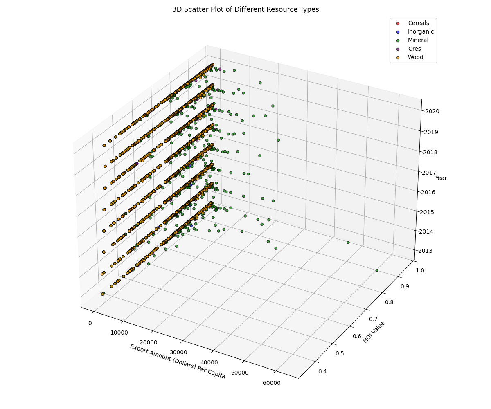
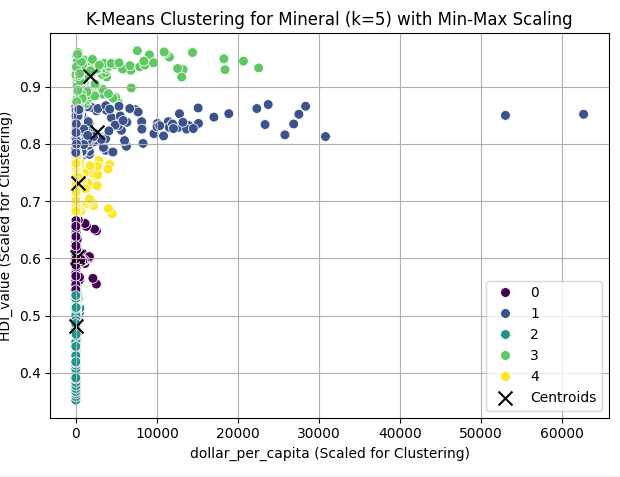
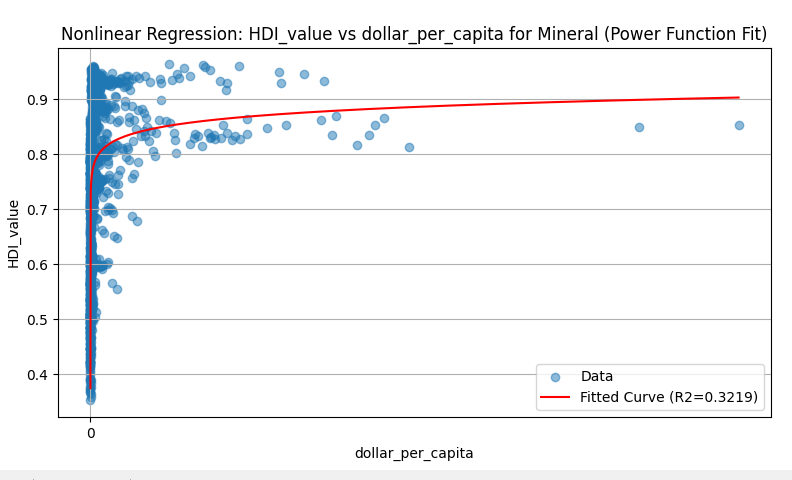

# Natural Resource Exports & HDI Analysis

## Project Overview

This project investigates the complex relationship between natural resource exports and a country's Human Development Index (HDI). The impact of such exports has long been debated, with some theories suggesting accelerated development through capital inflow, while others point to negative effects like the "resource curse" and "Dutch disease," fostering corruption and complacency. Our goal is to analyze these competing hypotheses by examining the net effect of natural resource exports on the HDI, providing a unified perspective on their true impact.

We specifically focus on the export of cereal, oil, lumber, rare earth metals, and ores from countries worldwide during the period 2010-2020. The Human Development Index (HDI) serves as our primary metric, a composite index encompassing life expectancy, education, and standard of living.




Future plans for futher segmentation / clustering call for 2 nonlinear regression trends across 2 clusters to more concretely define patterns (in progress).


## Key Features

* **Comprehensive Data Analysis:** Utilizes data from UN Comtrade and UNDP's HDI database for a robust analysis.
* **Multi-Methodological Approach:** Employs a combination of linear regression, K-means clustering, and nonlinear regression to uncover various aspects of the relationship.
* **Statistical Validation:** R-squared measures are used to assess the accuracy of our regression models.
* **Visualizations:** Preliminary plots and scatterplots help in understanding global HDI trends and the relationship between specific resources and HDI.
* **Clustering for Insights:** K-means clustering identifies distinct groups of countries based on their resource export profiles and HDI.
* **Nonlinear Relationship Exploration:** Power law regression is applied for quadratic analysis to capture potential non-linear effects.

## Analysis Workflow

1.  **Preliminary Visualizations:**
    * Plots showcasing worldwide HDI trends.
    * Scatterplots illustrating the relationship between different resource types and HDI.
2.  **Linear Regression:**
    * Fits linear regression lines for each resource type against HDI across all countries over the 2010-2020 period.
3.  **K-means Clustering:**
    * Generates 8 clusters per resource type.
    * Exports 35 country-labeled `.csv` files for detailed cluster analysis.
4.  **Nonlinear Regression:**
    * Applies power law for quadratic analysis to identify non-linear relationships.
    * Calculates R-squared values for model accuracy assessment.

## Getting Started

### Installation

1.  **Clone the repository:**
    ```bash
    git clone [https://github.com/yourusername/P1.git](https://github.com/yourusername/P1.git)
    cd P1
    ```
    *(Replace `yourusername` and `P1` with your actual GitHub username and repository name if different.)*

2.  **Create a virtual environment (recommended):**
    ```bash
    python -m venv venv
    source venv/bin/activate  # On Windows, use `venv\Scripts\activate`
    ```

3.  **Install dependencies:**
    ```bash
    pip install -r requirements.txt
    ```

### Data Acquisition

The datasets used in this project are publicly available:

1.  **UN Comtrade:**
    * **Main portal:** [https://comtradeplus.un.org](https://comtradeplus.un.org)
    * **Oil dataset direct link (example):** [https://comtradeplus.un.org/TradeFlow?Frequency=A&Flows=X&CommodityCodes=2709&Partners=0&Reporters=all&period=all&AggregateBy=none&BreakdownMode=plus](https://comtradeplus.un.org/TradeFlow?Frequency=A&Flows=X&CommodityCodes=2709&Partners=0&Reporters=all&period=all&AggregateBy=none&BreakdownMode=plus)
    * *Note: You may need to download data for other specific resource types (cereal, lumber, rare earth metals, ores) from the UN Comtrade portal manually, selecting the relevant commodity codes and time periods.*

2.  **HDI Data, UNDP:**
    * **Direct download:** [https://hdr.undp.org/sites/default/files/2023-24_HDR/HDR23-24_Composite_indices_complete_time_series.csv](https://hdr.undp.org/sites/default/files/2023-24_HDR/HDR23-24_Composite_indices_complete_time_series.csv)

3.  **Population Data, World Bank:**
    * **Direct download:** [https://hdr.undp.org/sites/default/files/2023-24_HDR/HDR23-24_Composite_indices_complete_time_series.csv](https://hdr.undp.org/sites/default/files/2023-24_HDR/HDR23-24_Composite_indices_complete_time_series.csv)

### Project Structure

P1/
├── data/
│   ├── raw/                  # Raw downloaded datasets (e.g., Comtrade CSVs, HDI CSV)
│   └── processed/            # Processed and merged data files
├── notebooks/                # Jupyter notebooks for exploratory data analysis and specific analyses
├── src/                      # Python source code
│   ├── data_processing.py    # Scripts for cleaning, merging, and preparing data
│   ├── analysis.py           # Scripts for linear regression, clustering, nonlinear regression
│   └── visualization.py      # Scripts for generating plots
├── outputs/                  # Generated plots, tables, and clustering CSVs
├── .gitignore                # Specifies intentionally untracked files to ignore
├── README.md                 # This README file
└── requirements.txt          # List of project dependencies


## Usage

The primary workflow involves running Python scripts sequentially to process data, perform analysis, and generate outputs.

1.  **Organize and preprocess data:**
    * Initially, some manual organization in Excel might be beneficial for large raw CSVs.
    * Run the data processing script to clean and merge the datasets:
        ```bash
        python src/data_processing.py
        ```
        This script will typically save processed data into `data/processed/`.

2.  **Run analysis and generate visualizations:**
    * Execute the main analysis script to perform regressions, clustering, and generate plots.
        ```bash
        python src/analysis.py
        ```
        This script will save visualizations to `outputs/plots/` and clustering results (CSV files) to `outputs/clusters/`.

*(For a more interactive exploration of the analysis steps, refer to the Jupyter notebooks in the `notebooks/` directory if provided.)*

## Technologies Used

* Python
* Pandas
* NumPy
* Scikit-learn
* Matplotlib
* Seaborn
* Jupyter (for notebooks, if applicable)
* Microsoft Excel
* Google Colaboratory (for development/testing)
* Any Python IDE (e.g., VS Code, PyCharm)

## Authors

* **Richard Cai** (rjc432)
* **Wenkai Zhao** (wz459)

## Acknowledgments

* [UN Comtrade](https://comtradeplus.un.org) for trade data.
* [United Nations Development Programme (UNDP)](https://hdr.undp.org/data-center/human-development-index#/indicies/HDI) for Human Development Index data.
* [World Bank DataBank](https://databank.worldbank.org/source/population-estimates-and-projections#) for population data.
* Wikipedia for definitions of [resource curse](https://wikipedia.org/wiki/resource_curse) and [Dutch disease](https://wikipedia.org/wiki/dutch_disease).
